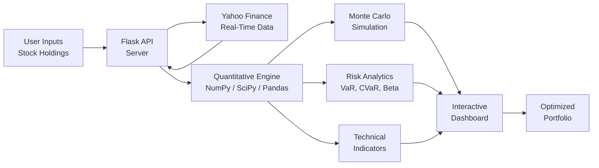
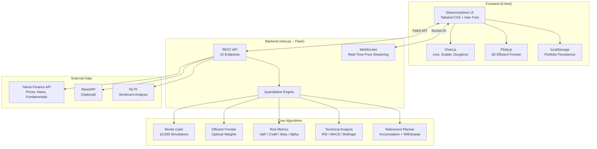
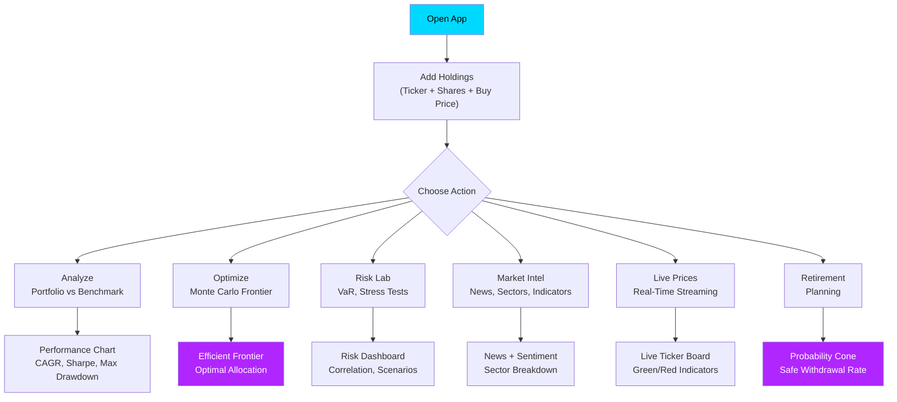
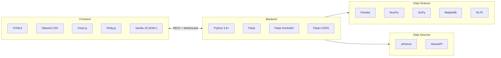
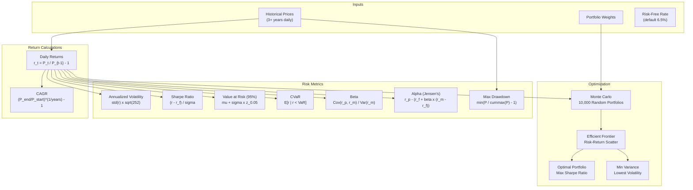
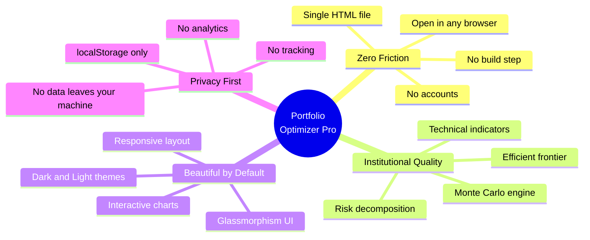

<h1 align="center">Portfolio Optimizer Pro</h1>

<p align="center">
  <strong>Institutional-grade portfolio analytics, powered by Monte Carlo simulations -- built for everyone.</strong>
</p>

<p align="center">
  Turn raw stock tickers into optimized, risk-aware investment strategies in seconds.<br/>
  No accounts. No subscriptions. No data sold. Just math.
</p>

---

## The Problem

Retail investors are flying blind. They pick stocks based on tips, trends, and gut feelings -- then wonder why their portfolio underperforms the market. Meanwhile, hedge funds and institutional desks use quantitative models that cost six figures to build.

**The gap between Wall Street analytics and Main Street access is massive.**

## Our Solution

**Portfolio Optimizer Pro** puts the same quantitative tools used by professional portfolio managers into a single, zero-setup web application. Users input their holdings, and the engine instantly delivers:

- Optimized asset allocations via **Monte Carlo simulation** (10,000 portfolio scenarios)
- Risk decomposition with **VaR, CVaR, Beta, Alpha, and Maximum Drawdown**
- Real-time **market intelligence** with news sentiment analysis
- **Retirement planning** with probabilistic outcome modeling
- Beautiful, interactive visualizations -- not spreadsheets

> **One interface. Zero cost. Institutional-grade results.**

---

## How It Works



---

## System Architecture



---

## User Journey



---

## Features at a Glance

| Feature | What It Does | Why It Matters |
|---|---|---|
| **Portfolio Analysis** | Compare your portfolio against S&P 500, Nifty 50, or any benchmark | Know if you're actually beating the market |
| **Monte Carlo Optimization** | Simulate 10,000 random portfolios to find the efficient frontier | Discover the mathematically optimal allocation |
| **Risk Metrics** | VaR (95%), CVaR, Beta, Alpha, Maximum Drawdown | Understand your downside *before* a crash |
| **Stress Testing** | Simulate worst-case historical scenarios on your portfolio | Sleep better knowing your worst-case numbers |
| **Correlation Matrix** | Heatmap of how your assets move together | Diversify smarter, not just wider |
| **Live Prices** | Real-time streaming via WebSocket | Stay in the loop without leaving the app |
| **News + Sentiment** | Aggregated news with NLP sentiment scoring | Gauge market mood around your holdings |
| **Technical Indicators** | RSI, MACD, Bollinger Bands | Spot entry/exit signals on any ticker |
| **Retirement Planner** | Monte Carlo accumulation + withdrawal simulation | Answer: "Will my money last?" with probability |
| **3D Efficient Frontier** | Interactive Plotly surface plot of risk-return space | Explore the frontier from every angle |

---

## Tech Stack



### Frontend
| Technology | Purpose |
|---|---|
| **HTML5** | Single-file application (`ft.html` -- zero build step) |
| **Tailwind CSS** (CDN) | Utility-first styling with dark/light theme support |
| **Chart.js** | Line charts, scatter plots, doughnut charts |
| **Plotly.js** | Interactive 3D efficient frontier visualization |
| **Inter Font** | Clean, modern typography via Google Fonts |
| **localStorage** | Persist portfolio holdings across browser sessions |

### Backend
| Technology | Purpose |
|---|---|
| **Python 3.8+** | Core runtime |
| **Flask 3.1** | Lightweight REST API framework |
| **Flask-SocketIO** | Real-time WebSocket price streaming |
| **Flask-CORS** | Cross-origin request handling |
| **Pandas 3.0** | DataFrame operations and time series |
| **NumPy 2.4** | Matrix operations and random sampling |
| **SciPy 1.17** | Statistical distributions (norm.ppf for VaR) |
| **Matplotlib** | Server-side chart generation (base64 encoded) |
| **yfinance** | Yahoo Finance data (prices, news, fundamentals) |
| **NLTK** | Natural language sentiment analysis |

---

## API Reference

The backend exposes **22 RESTful endpoints** across 6 domains:

### Core Analytics
| Endpoint | Method | Description |
|---|---|---|
| `/api/analyze` | POST | Portfolio vs benchmark performance comparison |
| `/api/optimize` | POST | Monte Carlo efficient frontier optimization |
| `/api/correlation` | POST | Asset correlation matrix |
| `/api/rebalance` | POST | Rebalancing recommendations |

### Risk Management
| Endpoint | Method | Description |
|---|---|---|
| `/api/risk-metrics` | POST | VaR, CVaR, Beta, Alpha calculations |
| `/api/rolling` | POST | Rolling Sharpe ratio over time |
| `/api/scenario` | POST | Bull / crash / flat market simulations |
| `/api/stress` | POST | Worst-case historical stress tests |

### Market Intelligence
| Endpoint | Method | Description |
|---|---|---|
| `/api/prices` | POST | Current stock prices with daily change |
| `/api/news` | POST | Aggregated news articles per ticker |
| `/api/sectors` | POST | Sector breakdown of holdings |
| `/api/dividends` | POST | Dividend yield and history |
| `/api/economic-indicators` | GET | Treasury yields, VIX, major indices |
| `/api/sentiment` | POST | NLP-based news sentiment scores |

### Advanced Charts
| Endpoint | Method | Description |
|---|---|---|
| `/api/charts/efficient-frontier-3d` | POST | 3D Plotly surface data |
| `/api/charts/time-series-decomposition` | POST | Trend, seasonality, residual |
| `/api/charts/candlestick` | POST | OHLCV candlestick data |
| `/api/charts/technical-indicators` | POST | RSI, MACD, Bollinger Bands |
| `/api/charts/drawdown` | POST | Underwater / drawdown chart |
| `/api/charts/risk-contribution` | POST | Per-asset risk contribution |

### Retirement
| Endpoint | Method | Description |
|---|---|---|
| `/api/retirement/calculate` | POST | Monte Carlo retirement simulation |

### System
| Endpoint | Method | Description |
|---|---|---|
| `/api/health` | GET | Server health check |

---

## Quantitative Methods



---

## Quick Start

### Prerequisites
- Python 3.8 or higher
- pip (Python package manager)
- A modern web browser (Chrome, Firefox, Edge)

### Installation

```bash
# Clone the repository
git clone https://github.com/your-username/portfolio-optimizer-pro.git
cd portfolio-optimizer-pro

# Create and activate a virtual environment
python -m venv .venv

# Windows
.venv\Scripts\activate

# macOS / Linux
source .venv/bin/activate

# Install dependencies
pip install flask flask-cors flask-socketio numpy pandas scipy matplotlib yfinance nltk
```

### Run

```bash
# Start the backend server
python new.py

# Output:
# Starting Portfolio Optimizer Backend...
# Server running on http://localhost:5000
```

Then open `ft.html` in your browser. That's it -- no build step, no bundler, no config.

### Optional: News API

For enhanced news features, set your [NewsAPI](https://newsapi.org/) key:

```bash
# Windows
set NEWS_API_KEY=your_api_key_here

# macOS / Linux
export NEWS_API_KEY=your_api_key_here
```

---

## Usage

1. **Add Holdings** -- Enter stock tickers (e.g., `AAPL`, `GOOGL`, `RELIANCE.NS`), number of shares, and buy price
2. **Analyze** -- Compare your portfolio against a benchmark index over 3+ years
3. **Optimize** -- Run Monte Carlo simulations to discover your efficient frontier
4. **Assess Risk** -- View VaR, CVaR, Beta, Alpha, and stress test results
5. **Monitor** -- Track live prices, news sentiment, and economic indicators
6. **Plan** -- Model retirement scenarios with probabilistic outcomes

---

## Design Philosophy



---

## Market Opportunity

| Segment | Size | Pain Point |
|---|---|---|
| Retail investors (global) | 150M+ | No access to quantitative tools |
| Finance students | 10M+ | Theory without practical application |
| Independent advisors | 300K+ | Expensive software licenses |
| Fintech startups | Growing | Need embeddable analytics modules |

Existing solutions like Bloomberg Terminal ($24K/yr), Morningstar Direct ($15K/yr), and FactSet ($12K/yr) serve institutions. **Portfolio Optimizer Pro serves everyone else.**

---

## Competitive Advantages

- **Zero infrastructure cost** -- No database, no cloud services, no subscriptions
- **Sub-second setup** -- Open a file, start analyzing
- **Real-time data** -- Powered by Yahoo Finance (free, reliable, global)
- **Offline-capable frontend** -- Portfolio data persists locally
- **Extensible API** -- 22 documented endpoints, ready for integration
- **Educational value** -- Every metric is grounded in published financial theory

---

## Roadmap

- [ ] User authentication and cloud-synced portfolios
- [ ] Multi-currency support with FX conversion
- [ ] Options and derivatives pricing (Black-Scholes)
- [ ] AI-powered allocation recommendations
- [ ] Mobile-native app (React Native)
- [ ] CSV/PDF portfolio import and report export
- [ ] Backtesting engine with custom strategies

---

## Project Structure

```
portfolio-opt/
├── new.py           # Flask backend -- 22 API endpoints, quantitative engine
├── ft.html          # Complete frontend -- UI, charts, state management
├── pie.py           # Standalone Monte Carlo visualization script
├── .venv/           # Python virtual environment
└── README.md        # You are here
```

---

## Contributing

Contributions are welcome! Whether it's a bug fix, new feature, or documentation improvement:

1. Fork the repository
2. Create a feature branch (`git checkout -b feature/amazing-feature`)
3. Commit your changes (`git commit -m 'Add amazing feature'`)
4. Push to the branch (`git push origin feature/amazing-feature`)
5. Open a Pull Request

---

## License

This project is open source and available under the [MIT License](LICENSE).

---

<p align="center">
  <strong>Built with math, not magic.</strong><br/>
  <sub>Portfolio Optimizer Pro -- Democratizing quantitative finance.</sub>
</p>
