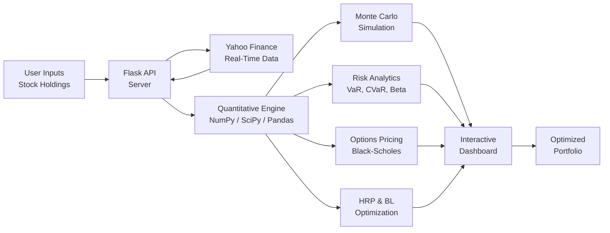
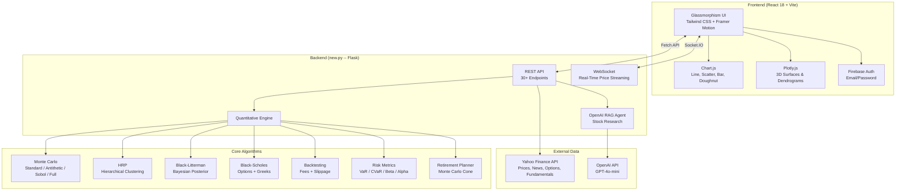

<h1 align="center">Bloom Analytics</h1>

<p align="center">
  <a href="https://github.com/anorak1709/delhi-dih-buggers"></a>
  <a href="https://github.com/anorak1709/delhi-dih-buggers"></a>
  <a href="https://github.com/anorak1709/delhi-dih-buggers"></a>
  <a href="https://github.com/anorak1709/delhi-dih-buggers"></a>
  <a href="https://github.com/anorak1709/delhi-dih-buggers/blob/main/LICENSE"></a>
</p>

<p align="center">
  <strong>Institutional-grade portfolio analytics, powered by Monte Carlo simulations — built for everyone.</strong>
</p>

<p align="center">
  Turn raw stock tickers into optimized, risk-aware investment strategies in seconds.<br/>
  Firebase auth · AI-powered research · Glassmorphism UI · 30+ quantitative endpoints
</p>

---

## The Problem

Retail investors are flying blind. They pick stocks based on tips, trends, and gut feelings -- then wonder why their portfolio underperforms the market. Meanwhile, hedge funds and institutional desks use quantitative models that cost six figures to build.

**The gap between Wall Street analytics and Main Street access is massive.**

## Our Solution

**Bloom Analytics** puts the same quantitative tools used by professional portfolio managers into a single web application. Users input their holdings, and the engine instantly delivers:

- Optimized asset allocations via **Monte Carlo simulation** (10,000+ portfolio scenarios) with variance reduction
- **Hierarchical Risk Parity (HRP)** and **Black-Litterman** portfolio optimization with AI sentiment
- Risk decomposition with **VaR, CVaR, Beta, Alpha, and Maximum Drawdown**
- **Black-Scholes options pricing** with full Greeks, options chains, and 3D volatility surfaces
- **Historical backtesting** with realistic market friction (fees + slippage)
- **AI-powered stock research agent** (OpenAI RAG pipeline)
- Real-time **market intelligence** with news sentiment analysis
- **Retirement planning** with probabilistic outcome modeling
- Informational **hover tooltips** on all financial metrics for instant learning
- **Tab state retention** -- switch between panels without losing your data

> **One interface. Institutional-grade results.**

---

## How It Works


```mermaid
flowchart LR
    A["User Inputs\nStock Holdings"] --> B["Flask API\nServer"]
    B --> C["Yahoo Finance\nReal-Time Data"]
    C --> B
    B --> D["Quantitative Engine\nNumPy / SciPy / Pandas"]
    D --> E["Monte Carlo\nSimulation"]
    D --> F["Risk Analytics\nVaR, CVaR, Beta"]
    D --> G["Options Pricing\nBlack-Scholes"]
    D --> H["HRP & BL\nOptimization"]
    E --> I["Interactive\nDashboard"]
    F --> I
    G --> I
    H --> I
    I --> J["Optimized\nPortfolio"]
```

---

## System Architecture


```mermaid
flowchart TB
    subgraph Frontend ["Frontend (React 18 + Vite)"]
        UI["Glassmorphism UI\nTailwind CSS + Framer Motion"]
        CJS["Chart.js\nLine, Scatter, Bar, Doughnut"]
        PLT["Plotly.js\n3D Surfaces & Dendrograms"]
        FB["Firebase Auth\nEmail/Password"]
    end

    subgraph Backend ["Backend (new.py -- Flask)"]
        API["REST API\n30+ Endpoints"]
        WS["WebSocket\nReal-Time Price Streaming"]
        QE["Quantitative Engine"]
        AI["OpenAI RAG Agent\nStock Research"]
    end

    subgraph DataSources ["External Data"]
        YF["Yahoo Finance API\nPrices, News, Options, Fundamentals"]
        OAI["OpenAI API\nGPT-4o-mini"]
    end

    subgraph Analytics ["Core Algorithms"]
        MC["Monte Carlo\nStandard / Antithetic / Sobol / Full"]
        HRP["HRP\nHierarchical Clustering"]
        BL["Black-Litterman\nBayesian Posterior"]
        BS["Black-Scholes\nOptions + Greeks"]
        BT["Backtesting\nFees + Slippage"]
        RM["Risk Metrics\nVaR / CVaR / Beta / Alpha"]
        RP["Retirement Planner\nMonte Carlo Cone"]
    end

    UI <-->|Fetch API| API
    UI <-->|Socket.IO| WS
    UI --> CJS
    UI --> PLT
    UI --> FB
    API --> QE
    API --> AI
    QE --> MC
    QE --> HRP
    QE --> BL
    QE --> BS
    QE --> BT
    QE --> RM
    QE --> RP
    API --> YF
    AI --> OAI
```

---

## Features at a Glance

| Feature | What It Does | Why It Matters |
|---|---|---|
| **Dashboard** | Summary cards (portfolio value, daily change, VaR, Sharpe), holdings overview | At-a-glance portfolio health |
| **Portfolio Management** | Add/remove holdings, drag-and-drop reorder | Organize your positions intuitively |
| **Monte Carlo Optimization** | 10K+ simulations with 4 methods (standard, antithetic, Sobol, full) | Find mathematically optimal allocations |
| **HRP Optimization** | Hierarchical Risk Parity with dendrogram visualization | Stable allocations without covariance inversion |
| **Black-Litterman** | Bayesian model with AI sentiment-to-views pipeline | Combine market equilibrium with your convictions |
| **Constrained Optimization** | Backtracking with per-ticker weight limits + sensitivity analysis | Real-world constraints + tornado charts |
| **Risk Metrics** | VaR, CVaR, Beta, Alpha, rolling Sharpe, scenario & stress tests | Understand downside before a crash |
| **Options Pricing** | Black-Scholes calculator, Greeks curves, options chain, 3D vol surface | Professional derivatives analysis |
| **Backtesting** | Historical simulation with fees, slippage, benchmark comparison | Validate strategies against real market history |
| **AI Research Agent** | OpenAI RAG pipeline with yfinance data context | Ask anything about any stock |
| **Live Prices** | Enriched ticker cards with sparklines, sentiment, headlines | Real-time market awareness |
| **Retirement Planner** | Monte Carlo simulation with probability cone and safe withdrawal rate | Answer "Will my money last?" |
| **Hover Tooltips** | Informational tooltips on all financial terms and metrics | Instant financial literacy |
| **Correlation Matrix** | Heatmap of asset return correlations | Diversify smarter |
| **Performance Analysis** | Portfolio vs benchmark with CAGR, Sharpe, max drawdown | Know if you're beating the market |

---

## Tech Stack

### Frontend
| Technology | Purpose |
|---|---|
| **React 18** | Component-based UI framework |
| **Vite** | Build tool with HMR (dev port 3000) |
| **Tailwind CSS** | Utility-first styling with dark/light mode |
| **Framer Motion** | Animations, transitions, micro-interactions |
| **Chart.js** (react-chartjs-2) | Line, bar, scatter, doughnut charts |
| **Plotly.js** (react-plotly.js) | 3D volatility surfaces, dendrograms |
| **Firebase Auth** | Email/password authentication |
| **react-beautiful-dnd** | Drag-and-drop portfolio reordering |
| **Cormorant Garamond + Plus Jakarta Sans** | Display + body typography |

### Backend
| Technology | Purpose |
|---|---|
| **Python 3.8+** | Core runtime |
| **Flask** | REST API framework (30+ endpoints) |
| **Flask-SocketIO** | Real-time WebSocket price streaming |
| **yfinance** | Yahoo Finance data (prices, options, news, fundamentals) |
| **NumPy / SciPy** | Matrix ops, statistical distributions, optimization |
| **Pandas** | DataFrame operations and time series |
| **Matplotlib** | Server-side chart generation (efficient frontier) |
| **OpenAI SDK** | GPT-4o-mini for AI research agent |

---

## Quick Start

### Prerequisites
- Python 3.8+
- Node.js 18+
- Firebase project (for authentication)

### Installation

```bash
# Clone the repository
git clone https://github.com/anorak1709/delhi-dih-buggers.git
cd delhi-dih-buggers

# Install backend dependencies
pip install flask flask-cors flask-socketio yfinance numpy pandas scipy matplotlib openai

# Install frontend dependencies
npm install
```

### Environment Setup

Create a `.env` file in the project root:

```env
VITE_API_URL=http://localhost:5000
VITE_FIREBASE_API_KEY=your_key
VITE_FIREBASE_AUTH_DOMAIN=your_project.firebaseapp.com
VITE_FIREBASE_PROJECT_ID=your_project_id
```

Set backend environment variable:
```bash
export OPENAI_API_KEY=your_openai_key
```

### Run

```bash
# Terminal 1: Start backend
python new.py
# Server running on http://localhost:5000

# Terminal 2: Start frontend
npm run dev
# App running on http://localhost:3000
```

---

## API Reference

The backend exposes **30+ RESTful endpoints**:

### Core Analytics
| Endpoint | Method | Description |
|---|---|---|
| `/api/prices` | POST | Current prices with daily change |
| `/api/analyze` | POST | Portfolio vs benchmark performance |
| `/api/optimize` | POST | Monte Carlo efficient frontier (4 methods) |
| `/api/correlation` | POST | Asset correlation matrix |
| `/api/risk-metrics` | POST | VaR, CVaR, Beta, Alpha |

### Advanced Optimization
| Endpoint | Method | Description |
|---|---|---|
| `/api/constrained-optimize` | POST | Backtracking optimizer with constraints |
| `/api/sensitivities` | POST | Sensitivity analysis (tornado chart) |
| `/api/hrp` | POST | Hierarchical Risk Parity |
| `/api/black-litterman` | POST | Black-Litterman with sentiment views |

### Options & Derivatives
| Endpoint | Method | Description |
|---|---|---|
| `/api/options/price` | POST | Black-Scholes pricing + Greeks |
| `/api/options/greeks` | POST | Greeks curves vs spot/time/vol |
| `/api/options/chain` | POST | Live options chain data |
| `/api/options/implied-vol` | POST | Newton-Raphson IV solver |
| `/api/options/vol-surface` | POST | 3D implied volatility surface |

### Backtesting & Risk
| Endpoint | Method | Description |
|---|---|---|
| `/api/backtest` | POST | Historical backtest with friction |
| `/api/rolling` | POST | Rolling Sharpe ratio |
| `/api/scenario` | POST | Market scenario simulations |
| `/api/stress` | POST | Worst-case stress tests |

### Intelligence
| Endpoint | Method | Description |
|---|---|---|
| `/api/live-analysis` | POST | Enriched ticker data (price, chart, sentiment) |
| `/api/ai-agent` | POST | OpenAI RAG research agent |
| `/api/sentiment` | POST | News sentiment analysis |
| `/api/retirement/calculate` | POST | Monte Carlo retirement planning |

---

## Quantitative Methods

| Method | Algorithm | Use Case |
|---|---|---|
| **Monte Carlo** | Random/Antithetic/Sobol/Combined weight sampling | Portfolio optimization, retirement planning |
| **HRP** | Hierarchical clustering → quasi-diagonal sort → inverse-variance bisection | Stable allocation without covariance inversion |
| **Black-Litterman** | Bayesian posterior: π + τΣP'(PτΣP'+Ω)^-1(Q-Pπ) | Combining market views with equilibrium |
| **Black-Scholes** | Analytical option pricing with Greeks (Δ, Γ, Θ, ν, ρ) | Options valuation and risk |
| **VaR/CVaR** | Parametric: μ + σ·z₀.₀₅ / E[r \| r < VaR] | Tail risk measurement |
| **Backtesting** | Historical replay with fee + vol-based slippage deduction | Strategy validation |

---

## Design Philosophy

- **Glassmorphism UI** — Backdrop blur, glass borders, grain overlays, floating orbs
- **Gold/bronze accent** (#c9985a) with dark/light mode support
- **State retention** — All panels stay mounted; switching tabs preserves data
- **Informational tooltips** — Every financial metric has a hover explanation
- **Responsive** — Desktop sidebar + mobile-friendly layouts

---

## Roadmap

- [x] Firebase authentication
- [x] AI-powered stock research agent (OpenAI)
- [x] Monte Carlo variance reduction (Antithetic, Sobol, Full)
- [x] Black-Scholes options pricing with Greeks
- [x] HRP and Black-Litterman optimization
- [x] Historical backtesting with friction
- [x] 3D volatility surface visualization
- [x] Glassmorphism design overhaul
- [x] Hover tooltips on all financial metrics
- [x] Tab state retention
- [ ] Advanced risk metrics (Sortino, Calmar, Treynor, Information Ratio, Omega Ratio)
- [ ] Factor-based portfolio analysis (Fama-French, momentum, quality)
- [ ] Multi-currency support with FX conversion
- [ ] CSV/PDF portfolio import and report export
- [ ] Mobile-native app (React Native)

---

## Project Structure

```
bloom-analytics/
├── new.py                    # Flask backend (30+ endpoints, quantitative engine)
├── src/
│   ├── App.jsx               # Main app with auth gate + panel rendering
│   ├── main.jsx              # Entry point
│   ├── index.css             # Global styles + glassmorphism
│   ├── constants/
│   │   └── tooltips.js       # Financial metric descriptions
│   ├── components/
│   │   ├── ui/               # Button, Card, Input, Loading, Toast, Motion, Tooltip
│   │   ├── dashboard/        # DashboardPanel
│   │   ├── portfolio/        # PortfolioPanel (DnD)
│   │   ├── analysis/         # AnalysisPanel
│   │   ├── optimize/         # OptimizePanel + ConstrainedOptimize
│   │   ├── risk/             # RiskPanel
│   │   ├── backtest/         # BacktestPanel
│   │   ├── options/          # OptionsPanel (BS + Greeks + chain + 3D surface)
│   │   ├── market/           # MarketPanel + AIAgent
│   │   ├── live/             # LivePanel
│   │   └── retirement/       # RetirementPanel
│   ├── context/              # AppContext, AuthContext
│   ├── services/             # api.js
│   └── config/               # firebase.js
├── package.json
├── vite.config.js
├── tailwind.config.js
└── README.md
```

---

## Contributing

Contributions are welcome! Whether it's a bug fix, new feature, or documentation improvement:

1. Fork the repository
2. Create a feature branch (`git checkout -b feature/amazing-feature`)
3. Commit your changes (`git commit -m 'Add amazing feature'`)
4. Push to the branch (`git push origin feature/amazing-feature`)
5. Open a Pull Request

---

## License

This project is open source and available under the [MIT License](LICENSE).

---

<p align="center">
  <strong>Built with math, not magic.</strong><br/>
  <sub>Bloom Analytics — Democratizing quantitative finance.</sub><br/><br/>
  <a href="https://github.com/anorak1709/delhi-dih-buggers">GitHub</a> ·
  <a href="https://github.com/anorak1709/delhi-dih-buggers/issues">Report Bug</a> ·
  <a href="https://github.com/anorak1709/delhi-dih-buggers/issues">Request Feature</a>
</p>
